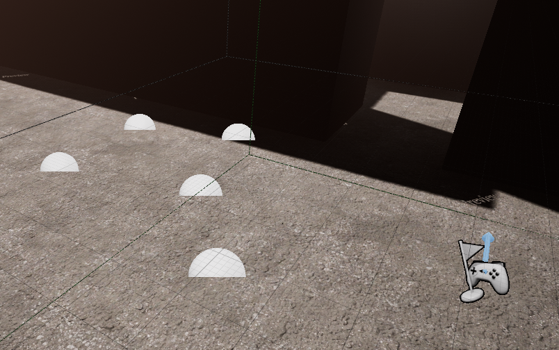
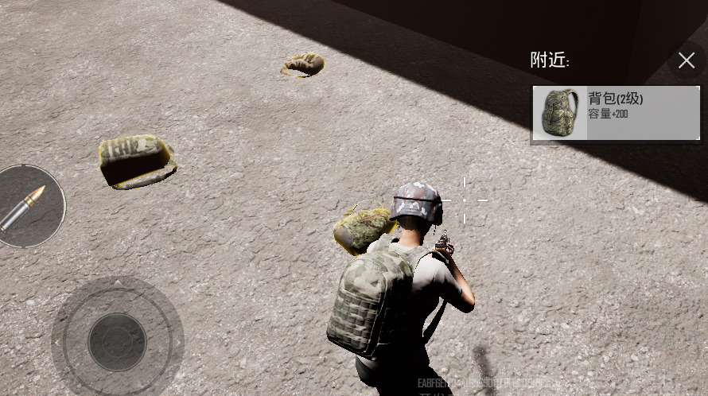

# Hello, World!
___

## 2022_2_7之前
* 已完成
    1.添加迷宫模型
    2.添加怪物(自动寻路+攻击)
* 存在问题
    1.模型添加材质失败
___

## 2022_2_7
* 已解决问题
    1.将小地图与大地图对齐
    2.小地图缩放

* 解决方案
    1.世界管理器中BP_MiniMapStandardPoint下变换的旋转应调为-90，这是因为迷宫模型的角度与世界角度不同，小地图是根据世界角度生成。如果不调整角度，会导致玩家起始点与小地图位置不匹配
    2.点击设置→工程设置，小地图，缩放比率进行修改，现在最佳值是20
___

## 2022_2_8
* 已解决问题
    添加玩家初始道具。
___

## 2022_2_9
* 存在问题
    1.按照官网教程在地图中添加物资刷新点无法刷新物资
    2.log显示刷新完成，但是无法在地图中显示
* 计划
    1.添加宝箱
    2.添加怪物死亡掉落物资
___

## 2022_2_10
* 解决问题
    1.不知道为啥，突然可以刷新物资了，有可能是昨天的代码没有成功编译吧。
    
    
    
    